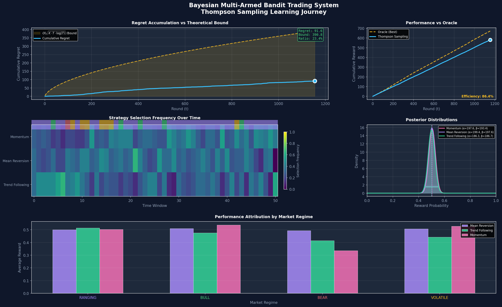
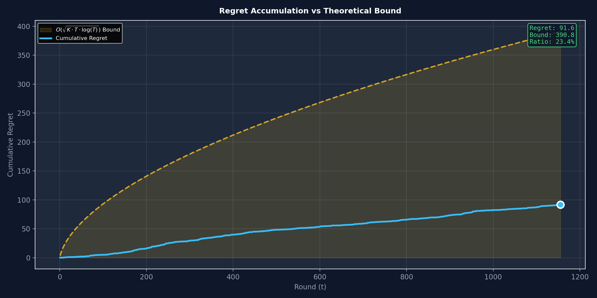
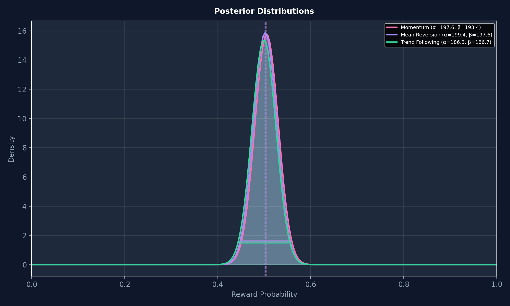
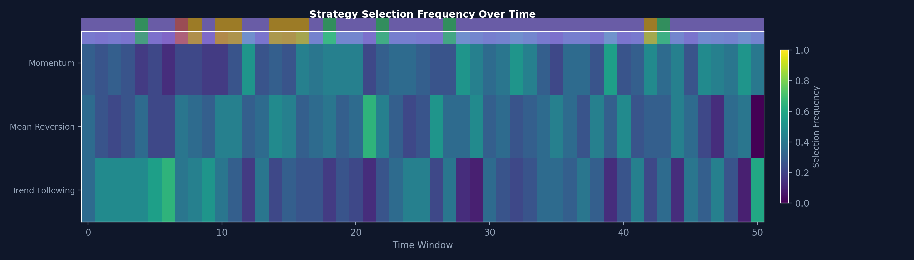

# Bayesian Multi-Armed Bandit Trading System

An intelligent trading system that uses **Thompson Sampling** to dynamically select between competing trading strategies while minimizing Bayesian regret.



## 🎯 What It Does

This system treats strategy selection as a **multi-armed bandit problem**:
- **Arms**: Momentum, Mean Reversion, Trend Following strategies
- **Reward**: Trading performance in [0, 1] range
- **Goal**: Maximize cumulative reward while minimizing regret

Thompson Sampling uses **Beta-distributed priors** that update with each observation, naturally balancing exploration vs. exploitation.

## 📊 Results on SPY (5 Years)

| Metric | Value |
|--------|-------|
| Regret Ratio | 23.44% of theoretical bound |
| Efficiency | 86.4% vs Oracle (perfect hindsight) |
| Sublinear Growth | ✓ Confirmed |
| Rounds | 1,155 trading days |

## 🖼️ Visualizations

### 1. Regret vs Theoretical Bound

Cumulative regret stays well below O(√(K·T·log(T))) bound.

### 2. Posterior Evolution

Beta distributions sharpen as evidence accumulates.

### 3. Selection Heatmap

Exploration → exploitation transition over time.

## 🚀 Quick Start

```bash
# Install dependencies
pip install -r requirements.txt

# Run simulation
python main.py
```

## 📁 Project Structure

```
├── main.py              # Main simulation orchestrator
├── thompson_sampling.py # Thompson Sampling engine (Beta priors)
├── strategies.py        # Trading strategies + Oracle baseline
├── market_data.py       # SPY data fetcher + regime detection
├── regret.py            # Regret calculation with bounds
├── visualizations.py    # 5 matplotlib visualizations
└── requirements.txt     # Python dependencies
```

## 🧠 How It Works

### Thompson Sampling Algorithm
1. Initialize Beta(α=1, β=1) prior for each strategy (uniform)
2. Sample from each posterior: `θ ~ Beta(α, β)`
3. Select strategy with highest sample
4. Execute trade, observe reward `r ∈ [0, 1]`
5. Update: `α += r`, `β += (1 - r)`
6. Repeat

### Trading Strategies
- **Momentum**: Buy winners, sell losers (best in Bull/Bear)
- **Mean Reversion**: Buy oversold, sell overbought (best in Ranging)
- **Trend Following**: Follow moving average crossovers

### Market Regimes
Detected from price data using:
- 20-day momentum
- 20-day volatility
- SMA crossovers

Classifications: BULL, BEAR, RANGING, VOLATILE

## 📈 Theoretical Background

Thompson Sampling achieves **O(√(K·T·log(T)))** regret where:
- K = number of arms (strategies)
- T = number of rounds

This is **near-optimal** for stochastic bandits.

## 🛠️ Configuration

Edit `main.py` to customize:
```python
sim = BayesianTradingSimulation(
    years=5,        # Years of SPY data
    start_idx=50    # Skip first N days for indicator warmup
)
sim.visualize(show=True)  # Set True for interactive display
```

## 📝 License

MIT License
